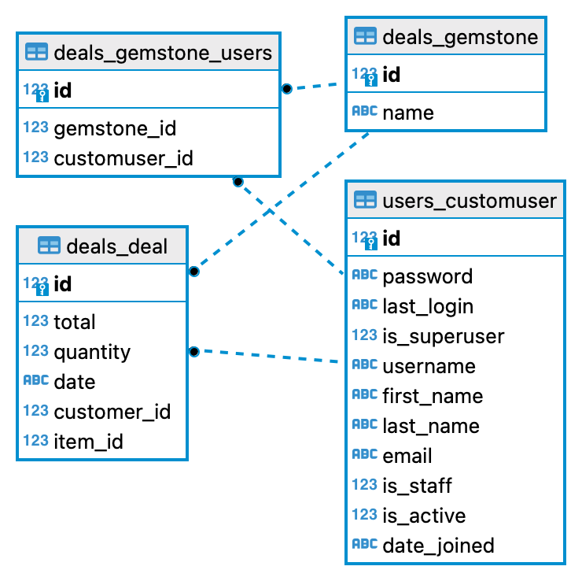

# Deals

Приложение **Deals** позволяет загружать и обрабатывать типовые .csv файлы с информацией о сделках по продаже драгоценных камней, а также извлекать информацию о топ-5 покупателях по общей сумме покупок за весь период.

## Схема базы данных


## Конфигурация

Контейнеры Docker:
1. db
2. backend
3. nginx

Файлы docker-compose:
- `docker-compose.yml` - для локального запуска.

## Локальный запуск

Для локального запуска клонируйте репозиторий на свой компьютер и перейдите в него в командной строке:
```shell
git clone https://github.com/GhostOfMadness/deals_test_task.git
cd deals_test_task
```

Создайте файл `.env` в корне проекта:
```shell
cp .env.exemple .env
```

Переменные окружения в .env.example:
```shell
ENV=.env

# Django settings
DJANGO_SECRET_KEY=django-secret-key
DJANGO_DEBUG=0
DJANGO_ALLOWED_HOSTS=host1 host2 host3 ...
DJANGO_STATIC_URL=django-static-url
DJANGO_STATIC_ROOT=django-static-root-folder-name

# Postgre settings
POSTGRES_DB=django
POSTGRES_USER=django_user
POSTGRES_PASSWORD=some_strong_password
DB_HOST=db
DB_PORT=5432
```

Убедитесь, что в вашей системы установлен Docker (или [установите](https://www.docker.com/get-started/) его) и выполните следующие команды в корне проекта:
```shell
docker compose build
docker compose up
```

Проект запустится на `http://127.0.0.1:8000/`.

## Как работать с проектом

Для работы с проектом доступно 2 эндпоинта, взаимодействие с которыми осуществляется через интерфейс RESTful API. Общий префикс - `/api/v1/`.

1.**/upload/**

Загрузка и обработка .csv файла.

Пример файла:
|customer|item|total|quantity|date|
|--------|----|-----|-----|----|
|User1|Сапфир|80000|3|2018-12-14 08:29:52.506166|
|User1|Рубин|20500|5|2018-12-14 14:43:45.883282|
|User2|Сапфир|40000|2|2018-12-15 15:00:59.858739|
|User2|Петерсит|60000|4|2018-12-16 00:01:13.013713|

Пример запроса:
```shell
POST: /api/v1/upload/
{
    "deals": string <binary>,
}
```
Пример ответа при успешной загрузке:
```shell
{
    "Status": "OK",
}
```
Пример ответа при возникновении ошибки:
```shell
{
    "Status": "Error",
    "Desc": "<Описание ошибки>",
}
```
При обработке файла проверяется его размер (файл не должен быть пустым), расширение, возможность получения основных параметров (тип разделителей, кавычек и т.д.), заголовки, типы данных в столбцах.

2.**/top/**

Извлечение информации о топ-5 клиентах по сумме покупок за весь период. Для каждого покупателя указывается логин, общая сумма потраченных средств, а также список драгоценных камней, приобретенных этим покупателем, из набора наименований, которые приобрели минимум двое из топ-5 покупателей.
Пример ответа:
```shell
GET: /api/v1/top/

{
    "response": [
        {
            "username": "User1",
            "spent_money": "100500",
            "gems": [
                "Сапфир",
                "Рубин"
            ]
        },
        {
            "username": "User2",
            "spent_money": "100000",
            "gems": [
                "Сапфир",
                "Петерсит"
            ]
        },
        ...
    ]
}
```

## Документация API
- `http://127.0.0.1:8000/redoc/` - Redoc
- `http://127.0.0.1:8000/swagger/` - Swagger